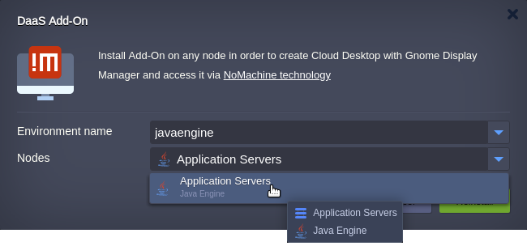
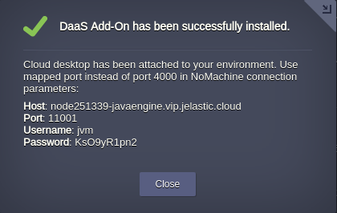
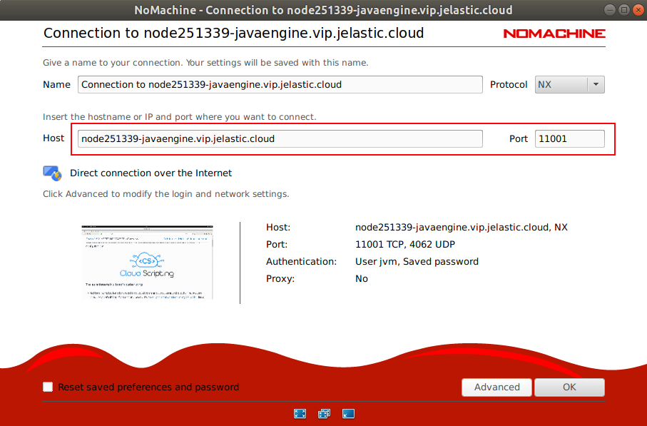

 

# Desktop-as-a-Service Add-On

This Add-On allows to attach Cloud Desktop to any of *[nodeTypes](http://cloudscripting.demo.jelastic.com/creating-manifest/selecting-containers/#all-containers-by-type)*: javaengine, tomcat, glassfish, wildfly, springboot, vds, storage in Jelastic PaaS.    

It downloads and installs NoMachine for Linux client-server software from the official web site for personal use only: [https://www.nomachine.com/download/](https://www.nomachine.com/download/). You can also Bring Your Own License (BYOL) requested from the vendor for commercial purposes.

Use NoMachine client software appropriate for your platform to connect to Cloud Desktop.

## Add-On Installation

Get your Jelastic account at any of available [hosting provider](https://jelastic.cloud/).

Click the **DEPLOY TO JELASTIC** button, specify your email address within the widget and press **Install**.

> **Note:** If you are already registered at Jelastic, you can apply this add-on by importing the  [package manifest raw link](https://raw.githubusercontent.com/jelastic-jps/basic-examples/master/daas-addon/daas-addon.yaml).  
  
## Installation Process

In the opened confirmation window at Jelastic dashboard choose a destination environment and target node:  

* __Environment name__  

* __Nodes__  

and click on __Install__.

 

Once the deployment is finished, you’ll see an appropriate success pop-up.

 

 In NoMachine client software, use connection string and credentials from the pop-up to connect to the Cloud Desktop.

 

Once the connection established successfully you may tune your remote Cloud Desktop adding and customizing software via [sudo](https://en.wikipedia.org/wiki/Sudo) command.
